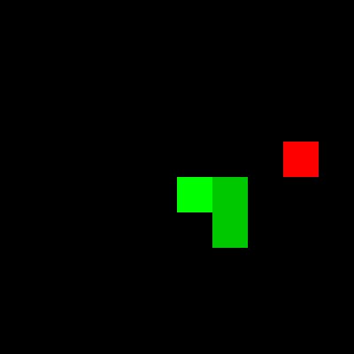
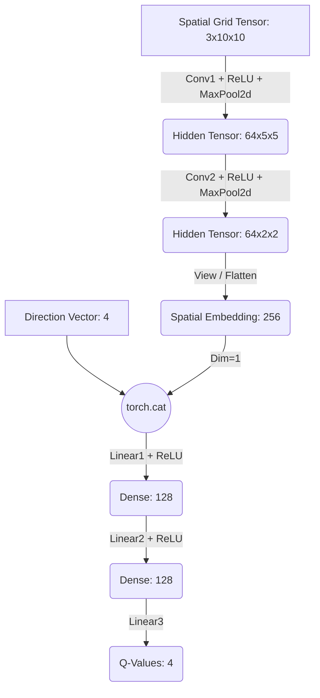

# Deep Q-Network (DQN) for Snake: A Late Fusion Architecture

This repository contains a complete implementation of a Deep Reinforcement Learning agent trained to solve the Snake game on a 10x10 grid. 

The agent uses the **DQN (Deep Q-Network)** algorithm coupled with a multi-input neural architecture (*Late Fusion*) to overcome the environment's partial observability problem.

---

## 🚀 Results: The Mathematical Proof

The agent achieves remarkable performance for a classic DQN, reaching an **average snake length of 22 blocks** over a thousand evaluation games (out of a theoretical maximum of 100 on this grid).

[Example :]

*Demonstration of a visual game where the agent intelligently navigates to reach a size of 30.*

---

## 🔬 Technical Architecture and Engineering Choices

Solving Snake via RL on a grid is not trivial. One important challenge lies in defining the State ($S_t$) within the Markov Decision Process (MDP).

### 1. Spatial State: Multi-Channel Encoding

Instead of representing the grid with scalars (0 for empty, 1 for body, 2 for head, 3 for apple) which blurs the convolution filters' collision detection, we use a clean spatial encoding across 3 channels (Spatial One-Hot Encoding):
* **Channel 0:** Binary mask of the snake's body.
* **Channel 1:** Binary mask of the head.
* **Channel 2:** Binary mask of the apple.

The spatial observation tensor thus has a dimension of $(Batch, 3, 10, 10)$.

### 2. Solving the POMDP: Late Fusion

A convolution on a static frame is **temporally invariant**. It does not know the snake's velocity vector. Without this information, the agent cannot distinguish a valid movement from an immediate "deadly U-turn," violating the Markov assumption.

Our **Late Fusion** architecture solves this problem by merging two information streams:
1. **Spatial Stream (CNN):** Two `Conv2d` layers with `MaxPool2d` are very likely to be extracting the geometric features from the grid (collisions, walls, target).
2. **Kinematic Stream (Direction):** The snake's current direction vector (One-Hot Encoding of size 4) is injected directly into the Fully Connected (`Linear`) layers.

---

## 🛠️ Installation and Reproduction

### Dependencies

This project was developed under Conda with Python 3.11.15 and PyTorch (CUDA accelerated). Industrial reproducibility standards are met via environment files.

* **Via Pip:** `pip install -r requirements.txt`
* **Via Conda (recommended for Deep Learning):** `conda env create -f environment.yml`

### 📂 Project Structure 

The entirety of the engineering (game mechanics, mathematical architecture, optimization, and evaluation) is documented and sequentially executable within a single interactive file. This narrative format promotes readability and reproducibility of the experiment. 

The notebook is divided into major logical sections:

* **1. Gymnasium Environment:** Creation of the `SnakeEnv` class inheriting from `gym.Env`. This section includes the game engine, conditional reward engineering, Pygame visual rendering, and the "DFS Backtracking" algorithm to generate topologically valid random snakes.
* **2. Replay Buffer:** Implementation of a cyclic memory (`deque`) to store the agent's transitions and enable decorrelated sampling (Experience Replay).
* **3. Deep-Q Network:** Definition of the PyTorch neuromimetic architecture calibrated for a 10x10 grid. It features the implementation of the dual-convolutional network and the *Late Fusion* mechanics merging the spatial grid and the directional vector.
* **4. Training & Training Loop:** This is the algorithmic core of the learning process. This section defines the Adam optimizer, the exploration policy (Epsilon-Greedy), the temporal loss function (MSE), and orchestrates the training. The full training uses a phased approach (Curriculum Learning), progressively increasing the difficulty (initial snake size ranging from 7 to 30) over thousands of episodes.
* **5. CUDA Verification:** Utility cells to verify hardware acceleration (GPU) and tensor allocation.
* **6. Inference & Benchmark:** Purely greedy evaluation scripts. It allows visually comparing a random agent with the pre-trained model, and includes an automated benchmark function running 100 games in "headless" mode to calculate performance statistics (Max, Min, Mean, Standard Deviation).
* **7. GIF Generation:** Capture tool using `imageio` to save the agent's best games as animations, making it easier to share the results.

## 🕹️ Usage

Since the entire project is consolidated into a single Jupyter Notebook, there are no command-line scripts to execute. Simply start your Jupyter environment, open the notebook, and run the cells sequentially or navigate to the specific sections below.

### Run the Demonstration

Don't waste time training the model from scratch. We provide the pre-trained weights (`demonstration_model.pth`) to visualize the expert agent immediately.

1. Run the prerequisite cells (Imports, Gymnasium Environment, Replay Buffer, and Deep-Q Network definitions).
2. Navigate to section **6. Inference & Benchmark** > **Trained agent**.
3. Ensure the pre-trained weights are loaded in the preceding cells.
4. Run the cell to launch a visual Pygame demonstration of 5 consecutive games.

### Reproduce the Statistical Benchmark

To reproduce the statistical performance of the agent, you can run the benchmark function which executes games in purely Greedy mode without graphical rendering (maximum speed).

1. Ensure the pre-trained weights are loaded in the preceding cells.
2. Navigate to section **6. Inference & Benchmark** > **Benchmark**.
3. Run the cell calling `benchmark_model(...)` to evaluate the agent over 100 episodes and print the Mean/Standard Deviation.

### Relaunch Training

If you want to train the model from scratch or modify hyperparameters (e.g., tweaking the learning rate, batch size, or the Curriculum Learning schedule):

1. Navigate to section **4. Training & Training Loop** > **Complete training**.
2. Modify the `phases` dictionary to adjust the curriculum parameters (number of episodes, initial `SNAKE_SIZE`, epsilon decay, etc.).
3. Run the cell to start the multi-phase training loop.
## 🧠 Reward Engineering Details

The reward function has been sculpted to maximize convergence and avoid "Reward Hacking" (when the snake spins in circles to avoid death):

* **Death (Wall or Body):** $-10$ (Termination).
* **Apple Eaten:** $+10$.
* **Standard Movement (Urgency):** $-0.05$ (to encourage speed).
* **Absolute Victory Condition:** If `len(snake) == grid_size^2`, the episode ends cleanly with a jackpot of $+100$, preventing a full-grid collision crash.

---

## 📄 License

This project is licensed under the MIT License - see the [LICENSE](LICENSE) file for details.
